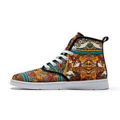
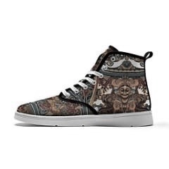
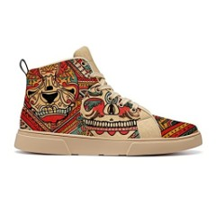
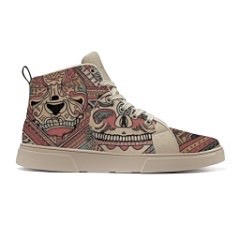
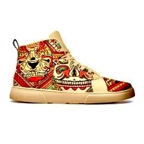
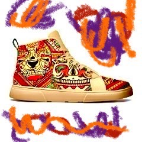
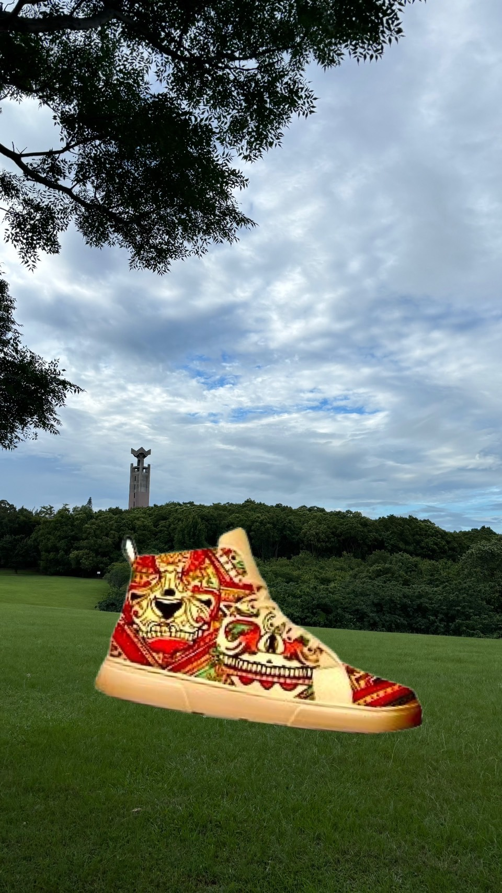
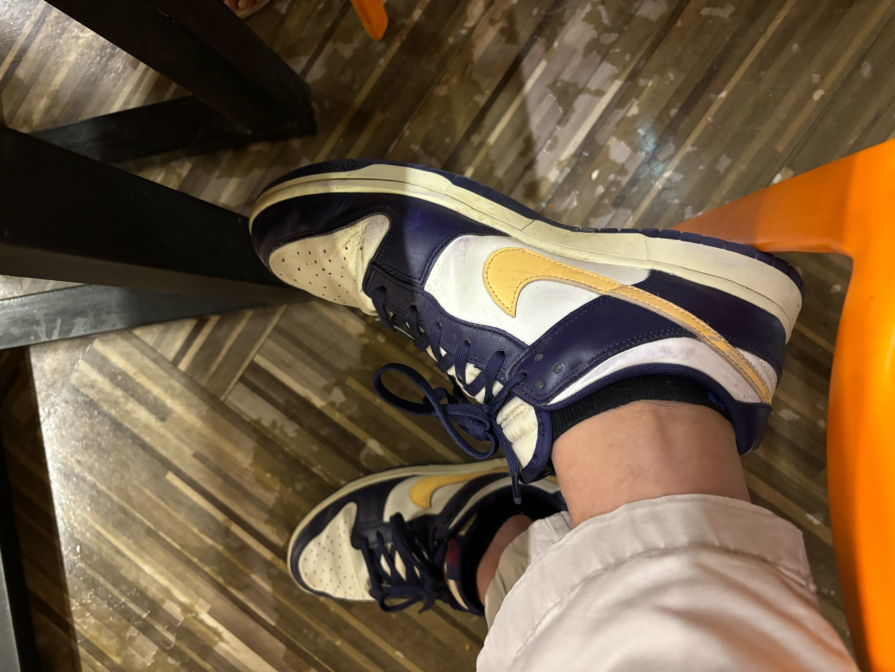

|編號|照片|真實值|預測值|說明|
|-|-|-|-|-|
|A||AI|Real|原始資料庫圖片|
|A-1||AI|Real|A 彩度降低後|
|B||AI|Real|原始資料庫圖片|
|B-1||AI|Real|B 彩度降低後|
|B-2||AI|Real|B 彩度提高後|
|B-3||AI|AI|B-2 背景增加彩度高筆畫後|
|B-4||AI|Real|B-2 背景加入真實圖片|
|C||Real|Real|我們自行拍攝的圖片|
|C-1||Real|AI|C 彩度提高後|